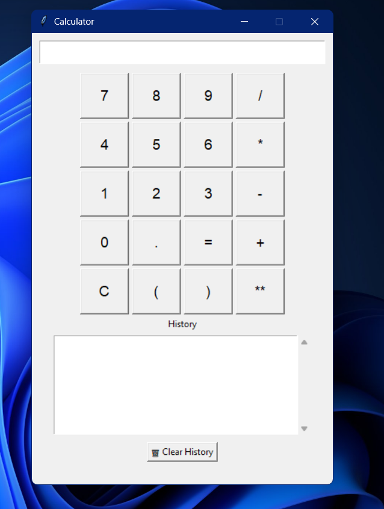

# 🧮 Python GUI Calculator with History

A simple yet powerful calculator built using Python's `tkinter` library. This calculator supports basic arithmetic operations, exponentiation, and includes a scrollable history panel with timestamped logs.

 <!-- Replace with actual screenshot if available -->

---

## 🚀 Features

- Clean graphical interface using Tkinter
- Keypad-style input with buttons
- Supports: `+`, `-`, `*`, `/`, `**`, `()`, `.`
- Scrollable calculation history saved to `calc_history.txt`
- Timestamped logging for each operation
- Clear button for inputs and history

---

## 🛠 How to Run

1. **Clone the repository:**
   ```bash
   git clone https://github.com/your-username/gui-calculator.git
   cd gui-calculator
   ```

2. **Run the Python file:**
   ```bash
   python "gui calculator.py"
   ```

---

## 📁 Project Structure

```
gui-calculator/
├── gui calculator.py      # Main GUI logic
├── calc_history.txt       # Stores calculation history (auto-generated)
└── README.md              # You're reading it!
```

---

## 📦 Requirements

- Python 3.x
- No external libraries required (pure Tkinter)

---

## 📝 How History Works

- Every calculation is saved in `calc_history.txt`
- Log format: `[YYYY-MM-DD HH:MM:SS] expression = result`
- History visible inside the GUI with a clear option

---

## 📸 Optional Screenshot

You can take a screenshot of your app running and save it as `screenshot.png` in the same folder. It will automatically show up in this README on GitHub.

---

## 🔒 License

This project is open-source and available under the [MIT License](LICENSE).

---

## 🙌 Author

**Gaurang Agarwal**  
*Feel free to fork, modify, and share!*

---

## ⭐ GitHub Pro Tip

If you want to make your GitHub profile shine:
- Add a custom profile README
- Pin this project to your profile

## 🧭 Flowchart

You can view the project flowchart here:  
[📄 flowchart.pdf](flowchart.pdf)

